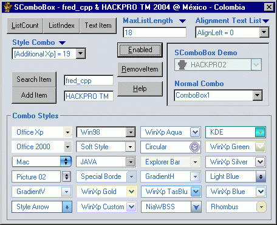



## SComboBox 1\.0\.1

### Description

English: This control is a customizable ComboBox with multiple appearances. I hope you it like. Description: This usercontrol simulates a ComboBox.

----

----

But adds new an great features like: - The first ComboBox On PSC that actually works in a single file control. - When the list is shown doesn't deactivate the parent form. - More than 20 Visual Styles; no images everything done by code. - Some extra cool properties

----

----

IMPORTANT NOTE 

----

So many thanks fred_cpp for his contribution for this project, some styles and Traduction to English of some comments. All rights Reserved © HACKPRO TM 2004

----

----

Fixes bugs Version 1.0.0

- ScrollBar Slider.

- ListIndex Property.

- Down or Up list when press keys.

- Drop down List.

----

New in this version 1.0.1

- Drop down when you press F4.

- Press Enter hidden list.

- MouseIcon property.

- MousePointer property.

- Down or Up list when press keys.

- Set ListIndex when the text change.

- AutoCompleteWord property.

- Const VK_LBUTTON.

- Const VK_RBUTTON.

- Add MouseIcon for each item.

- Add SeparatorLine for each group that you consider necessary.

- New comments.

----

Notes

----

AutoCompleteWord property: When it uses the property AutoCompleteWord and the list is

shown, the element was not located in the list to make quicker the search of the text

to complete.

SeparatorLine parameter: When it uses the parameter SeparatorLine it is not applicable

neither to the first element of the list (provided a single element exists) neither to

the last one.

MouseIcon parameter: It is not applied to inactive elements of the list.
 
### More Info
 

             |
---                |---
**Submitted On**   |2004-07-13 16:10:46
**By**             |[Heriberto Mantilla Santamaria](https://github.com/Planet-Source-Code/PSCIndex/blob/master/ByAuthor/heriberto-mantilla-santamaria.md)
**Level**          |Advanced
**User Rating**    |5.0 (109 globes from 22 users)
**Compatibility**  |VB 5\.0, VB 6\.0
**Category**       |[Custom Controls/ Forms/  Menus](https://github.com/Planet-Source-Code/PSCIndex/blob/master/ByCategory/custom-controls-forms-menus__1-4.md)
**World**          |[Visual Basic](https://github.com/Planet-Source-Code/PSCIndex/blob/master/ByWorld/visual-basic.md)
**Archive File**   |[SComboBox\_1769357132004\.zip](https://github.com/Planet-Source-Code/heriberto-mantilla-santamaria-scombobox-1-0-1__1-54816/archive/master.zip)

